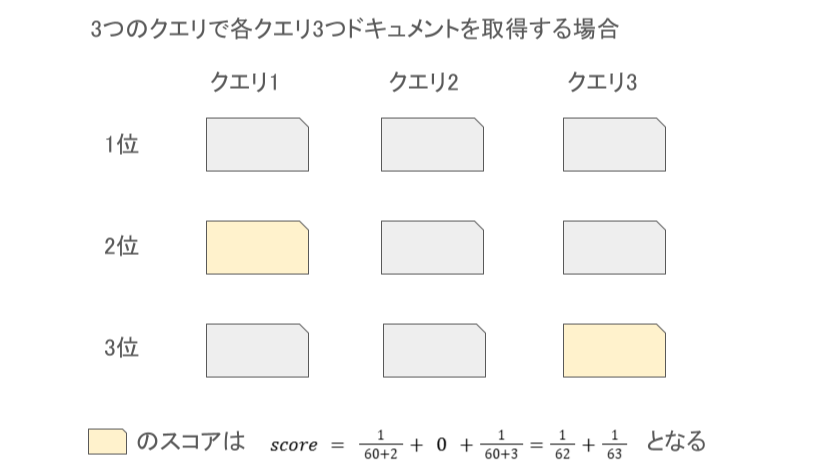
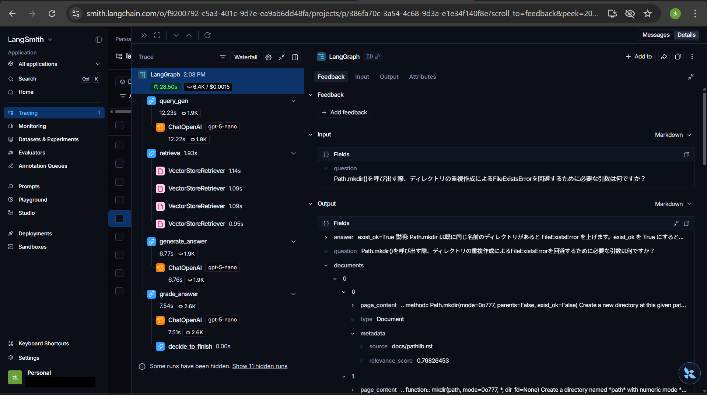
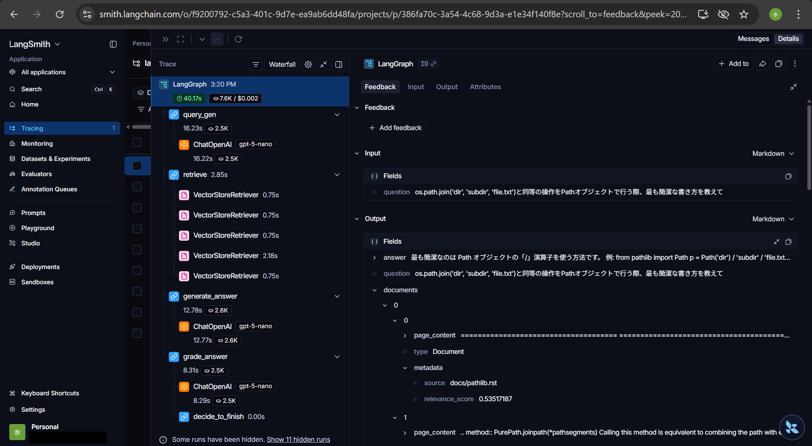
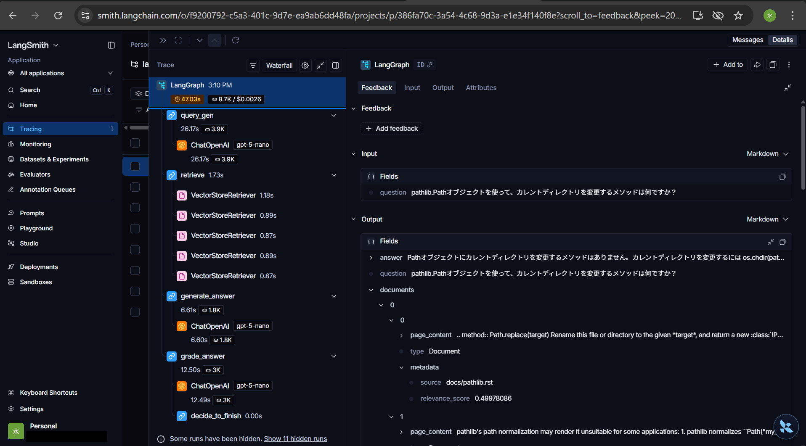

# LCEL, LangGraphを用いたRAG実装

このプロジェクトは、LangGraphによる自己評価による再試行があるRAGを実装した学習用リポジトリである。

## プロジェクト構成

```text
/langchain_learning
├── chroma_db # ChromaのDB
├── docker-compose.yml
├── dockerfile
├── docs                        # RAG対象のドキュメント
├── poetry.lock
├── pyproject.toml
├── .env                        # OpenAI, Cohere, LangSmithのAPIキーなど環境変数
└── src
    ├── graph                   # 状態遷移やワークフローのロジック
    │   ├── nodes.py            # ノードでの処理
    │   └── workflow.py         # ノードの結合や条件分岐
    ├── lcel
    │   ├── lcel.py             # 一本道のLCEL
    │   └── lcel_parallel.py    # 並列を導入したLCEL
    ├── main.py                 # RAGのエントリーポイント
    └── share
        ├── chains.py           # Langgraphで用いるMulti-Query, RRF, Rerankを含むチェーン
        ├── docs_downloader.py  # GithubからPythonドキュメントをダウンロードする関数
        ├── prompts.py          # LLMへのプロンプトテンプレートの管理
        ├── schema.py           # LangGraphで用いるステート
        ├── utils.py            # LangGraphで用いるReciprocal Rank Fusion(RRF)などのユーティリティ関数
        └── vectorstore.py      # Chromaに保存する関数とRetriever関数
```

## 工夫した点

#### 1. Multi-Query Retrievalによる堅牢なドキュメント取得
ユーザーの質問からLLMを用いて複数の検索クエリを生成し、Chromaからベクトル検索して、関連度の高いドキュメントを取得する手法を採用した。1つの検索クエリからドキュメントを取得する場合と比較して、この手法の利点は、ユーザーの質問に対して検索漏れを最小限に抑え、関連するドキュメントを取得できる点である。欠点は、取得ドキュメントが増え、後続のRRF, Cohereによるリランキング処理の計算コストが増える点である。
3~5個の検索クエリを生成し、1クエリ当たり4個のドキュメントを取得するので、延べ12~20個のドキュメントが取得される。クエリ間で重複しているドキュメントが取得されることもある。

#### 2. Reciprocal Rank Fusion(RRF)を用いた統計的手法によるリランキング
Multi-Queryで取得したドキュメントをクエリ間を横断してランキングするため、RRFを実装した。RRFは以下の式で各ドキュメントにスコアを付ける。
$$
score(d) = \sum_{r \in R} \frac{1}{k + r(d)}
$$
- $R$: 複数クエリによる検索結果の集合
- $k$(定数): デフォルトは推奨値`60`を使用
- $r(d)$: 各検索結果におけるドキュメント$d$の順位

具体例



各クエリとドキュメントのベクトル間距離はスケールが異なるため、クエリを超えたドキュメントの関連度をベクトル間距離で比較できない。RRFの利点は、各クエリで取得したドキュメントの順位を利用してフラットにリランキングできる点である。

リランクしたドキュメントを上位20個に絞り、後続のCohereに渡す。

#### 3. Cohereを用いた、質問とのセマンティック距離によるリランキング

RRFで絞り込んだドキュメントに対してCohereを用いてユーザーの質問とのセマンティック距離でリランキングし、LLMに渡すコンテキストを4つに絞る。

#### 4. 評価用LLMによるSelf-Check
LLMが生成した回答がユーザーの質問に妥当かを評価用LLMにコンテキストを渡して検証する。回答が妥当性を欠いている場合は、クエリ生成から再試行を行う。

- Roleの分離による客観的な評価
回答生成用とは別のLLMに評価者のロールを与えることで、生成された回答を必ずしも肯定せず、批判的な視点から検証することが可能になる。

- コンテキストに基づく精密な評価
評価用LLMに回答の根拠となるコンテキストを共有することで、LLMの内部知識に依存した評価ではなく、与えた情報に基づく正確な評価が可能になる。

**導入の経緯と改善効果**

当初はコンテキストを渡さずに評価を行っていたが、Pythonのライブラリに関する質問において、回答生成用LLMが最新のドキュメントを参照して回答したのに対し、評価用LLMは自身の知識に基づくPython3.11以前の仕様で、正しい回答を「ハルシネーション」と誤判定するケースが見られた。そこで、評価用LLMにも同一のコンテキストを渡すと、最新仕様に基づく正確な評価とフィードバックを得られるようになった。

#### 5. 原因分析用LLMによる失敗時のフォローバック
再試行後の回答が評価用LLMにより不適当と評価された場合、原因分析用LLMにより原因分析を行う。原因分析用LLMに渡すデータはユーザーの質問、初回に生成したクエリ、初回にLLMに渡したコンテキスト、初回と再試行時に評価用LLMが生成したフィードバックである。

## セットアップ

### 1.依存関係のインストール

```bash
poetry install
```

### 2.環境変数の設定
ルートディレクトリに`.env`を作成し、必要な設定やAPIキーを記述する。

```env
OPENAI_API_KEY=your_openai_api_key_here
OPENAI_MODEL_NAME=gpt-5-nano(推奨)
OPENAI_EMBEDDING_MODEL_NAME=text-embedding-3-small(推奨)
COHERE_API_KEY=your_cohere_api_key_here
COHERE_RERANKING_MODEL_NAME=rerank-v3.5(推奨)
CHROMA_PERSIST_DIRECTORY=./chroma_db
LANGSMITH_TRACING_V2=true
LANGSMITH_API_KEY=your_langsmith_api_key_here
LANGSMITH_PROJECT="langchain-learning"
```

### 3.ドキュメントの追加と保存
まず、ドキュメントをdocsディレクトリに保存する。
以下を実行すると、指定したpythonのライブラリをGithubからダウンロードし、docsディレクトリに保存される。
```bash
poetry run python src/share/docs_downloader.py <pythonのライブラリ名>
```

以下を実行しドキュメントをベクトル化しChromaに保存する。

```bash
poetry run python src/share/vectorstore.py <ファイル名>
```

### 4.RAGによる質問回答
main.pyを実行して、RAGによる質問回答を開始する。
```bash
poetry run python src/main.py
```

## 実行例
1. データの準備とベクトル化
公式ドキュメントをGithubからダウンロードしベクトルデータベースに登録する。

```bash
poetry run python src/share/docs_downloader.py pathlib
poetry run python src/share/docs_downloader.py os

poetry run python src/share/vectorstore.py docs/pathlib.rst
poetry run python src/share/vectorstore.py docs/os.rst
```

2. 質問の実行
ケースA：特定ドキュメント内の詳細質問

質問: Path.mkdir()を呼び出す際、ディレクトリの重複作成によるFileExistsErrorを回避するために必要な引数は何ですか？

```bash
回答
exist_ok=True

説明: Path.mkdir は既に同じ名前のディレクトリがあると FileExistsError を上げます。exist_ok を True にすると、同名のディレクトリが既に存在していてもエラーになりません（ただしそのパスがディレクトリでない場合は例外が出ます）。必要に応じて parents=True を併用すると中間ディレクトリも作成します。

例:
- Path('dir').mkdir(exist_ok=True)
- Path('a/b/c').mkdir(parents=True, exist_ok=True)
```
検証: 正しく答えられている。LangSmithにてpathlib.rstの該当コンテキストがLLMに渡されていることを確認済み(実行時間: 28.5s)


ケースB：複数ドキュメントに跨る質問

質問: os.path.join('dir', 'subdir', 'file.txt')と同等の操作をPathオブジェクトで行う際、最も簡潔な書き方を教えて

```bash
回答
最も簡潔なのは Path オブジェクトの「/」演算子を使う方法です。

例:
from pathlib import Path
p = Path('dir') / 'subdir' / 'file.txt'

これが os.path.join('dir', 'subdir', 'file.txt') と同等の結果になります。OSに応じた区切りが自動で適用されます。

補足として、明示的に joinpath を使うなら次の通りです:
p = Path('dir').joinpath('subdir', 'file.txt')
```
検証: 正しく答えられている。pathlib.rstから3件、os.rstから1件のコンテキストを統合して回答生成されていることを確認済み。(実行時間: 40.2s)



ケースC：ドキュメントに情報が存在しない質問

質問: pathlib.Pathオブジェクトを使って、カレントディレクトリを変更するメソッドは何ですか？

```bash
回答
Pathオブジェクトにカレントディレクトリを変更するメソッドはありません。カレントディレクトリを変更するには os.chdir(path) を使います。path には Path オブジェクトを渡しても構いません。
```
検証:pathlibに該当メソッドがない点、os.chdirで代替できる点に言及する回答を生成している。(実行時間: 47.0s)


